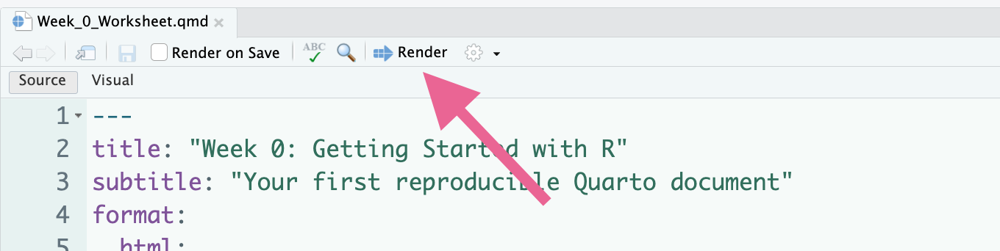
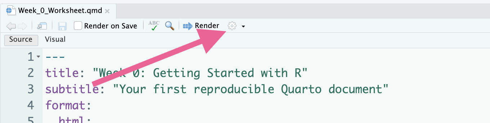
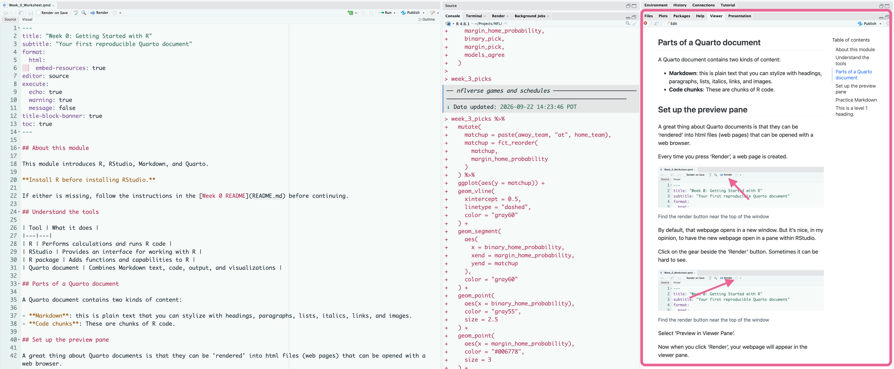
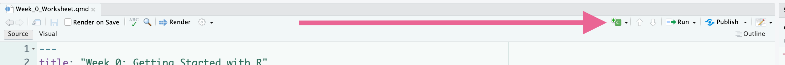

## About this module

This module introduces R, RStudio, Markdown, and Quarto.

**Install R before installing RStudio.** 

If either is missing, follow the instructions in the [Week 0 README](README.md) before continuing.

## Understand the tools

| Tool | What it does |
|---|---|
| R | Performs calculations and runs R code |
| RStudio | Provides an interface for working with R |
| R package | Adds functions and capabilities to R |
| Quarto document | Combines Markdown text, code, output, and visualizations |

## Install and load a package

R can do all kinds of amazing things but it can do even more amazing things if we install and load packages.

Packages are sorta like scripts or code other people have written that contain 'functions' we can use in our code.

For example, maybe someone else created a package with lots of functions useful to psychologists. 
They might call that package: psych

It's important to realize that installing a package and loading a package are different things.

**Installing** a package downloads it onto your computer.

**Loading** a package means you can use the package in your code or script.

For now, I want you to be able to recognize variables and functions in code.

*Variables* are a way to define a variable is a name we use to store data.

*Functions* are text followed by ().
Sometimes there are arguments (information) inside the ().

Truthfully, the difference between variables and functions is more complicated than that but that's a good place to start.

This chunk has one line of code. It is a function because it is some text followed by ().

Run it.
```{r}
#| eval: false

install.packages("tidyverse")
```
That chunk installed a package called 'tidyverse' and might take a long time finish downloading.

The function is 'install.packages()'

It accepts the argument "tidyverse" inside ().

So we can sometimes pass useful information to 'functions' as 'arguments' inside the ().

But after all that, you still can't use it! 
That's because you haven't loaded the package.

This chunk loads the package using the 'library()' function.
Run it.
```{r}
library(tidyverse)
```

## Parts of a Quarto document

A Quarto document contains two kinds of content:

- **Markdown**: this is plain text that you can stylize with headings, paragraphs, lists, italics, links, and images.
- **Code chunks**: These are chunks of R code.

## Set up the preview pane

A great thing about Quarto documents is that they can be 'rendered' into html files (web pages) that can be opened with a web browser.

Every time you press 'Render', a web page is created. 




By default, that webpage opens in a new window.
But it's nice, in my opinion, to have the new webpage open in a pane within RStudio.

Click on the gear beside the 'Render' button.
Sometimes it can be hard to see.



Select 'Preview in Viewer Pane'.

Now when you click 'Render', your webpage will appear in the viewer pane.



## Practice Markdown

### Headings

You can create headings in Markdown with '#'.

'#' is a level 1 heading.

'##' is a level 2 heading.

'###' is a level 3 heading.

You get the idea.

Press 'Render' above and see what the level 1 heading below looks like.

# This is a level 1 heading.

Now, modify the heading. Replace the single '#' with '##'. And change the text to reflect that it is now a level 2 heading.

Press 'Render' again.

Now try 3 '#'. 

Then 4 '#'.

What is the highest level heading?

### Bold and italics

You can **bold** text by encapsulating it with double-asterisks.

You can *italicize* text by encapsulating it with single-asterisks.

### Markdown cheatsheet

You can learn (or remember in my case) all the different Markdown tricks by looking at the cheatsheet. 

Find the cheat sheet in the Help menu: Help -> Cheat Sheets -> RMarkdown Cheat Sheet


## Run your first R code

Below is a chunk of R code. 

It begins with 3 backticks (these are not apostrophes. They are usually located above the tab key on your keyboard).

Next is 'r' inside a curly brace. 

Finally, it ends with 3 backticks.

Press the green play button (green triangle) to run the code. 

```{r}
2 + 2
```

The result should appear below the chunk: [1] 4

Because 2 + 2 = 4.

If you want to make a new chunk of r code, click the green c above.



## Create some variables

The assignment operator `<-` 'assigns' a value to a variable.

For now, a variable is a name we use to store a value.
(Whereas text outside chunks is just text)

In the below chunk, a variable called 'course_name' is 'assigned' the value of 'Getting Started with R'.

Then a variable called, 'number_of_sessions' is 'assigned the value of '10'.

Next, the variable called 'course_name' is printed to the screen.

Finally, the variable called 'number_of_sessions' is printed to the screen.

Run the chunk:
```{r}
course_name <- "Getting Started with R"
number_of_sessions <- 10

course_name
number_of_sessions
```

You should see two rows of output--the values assigned to course_name and number_of_sessions.

1. Change the values assigned to each variable then run the chunk again.
2. Change the names of the variables. What happens?
3. Change the names back before moving on.


## Use a variable in a calculation

Before you run this chunk, read it line by line.

What do you think each line does?

Are all the variables used in this chunk, defined in this chunk? 
Or are some of them defined in the previous chunk?

Now run the chunk.
```{r}
minutes_per_session <- 45

total_minutes <- number_of_sessions * minutes_per_session

total_minutes
```

Were you right?

Change the values assigned to the variables. What do you think will happen now?


## Create some data

There are lots of ways to represent data in R.

Vectors, tables, matrices, data frames, and plenty more.

We are going to use something called a tibble. 

A tibble is a rectangular dataset with rows and columns---in other words, a tibble looks like an excel spreadsheet or an SPSS document.

Read this chunk line by line. What happens? If you're not sure, run the chunk.
```{r}
practice_data <- tibble(
  activity = c("Reading", "Exercise", "Music"),
  minutes = c(30, 45, 20)
)

practice_data
```

Now edit the activities and minutes variables to reflect your life on a weekly basis.

Remember, you aren't restricted to just three rows!

## Visualize your data!

The following code uses the function 'ggplot()' to create a graph.

We'll learn more about ggplot later. For now, run the chunk!
```{r}
ggplot(
  practice_data,
  aes(x = activity, y = minutes)
) +
  geom_col(fill = "#006778") +
  labs(
    title = "How I might spend some free time",
    x = NULL,
    y = "Minutes"
  ) +
  theme_minimal()
```

Can you change the color?

Can you change the title?

Can you change the type of graph? (hint: try googling types of ggplot graphs)

## Finishing up

If you got this far, AWESOME!

Your last task is to save this document, close RStudio, open RStudio back up, and then press Render.

The point is to notice that we can save our analyses and run them again later.